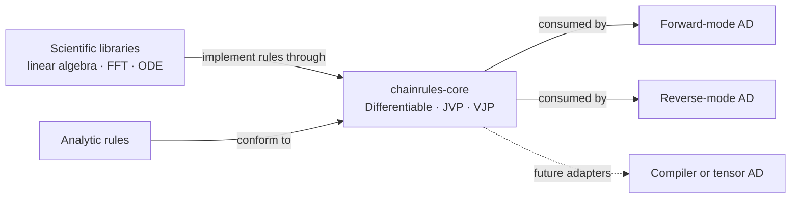

# ChainRules.rs

[](https://github.com/matrixlab-research/ChainRules.rs/actions/workflows/ci.yml)
[](https://www.rust-lang.org/)
[](LICENSE)

**A small, backend-agnostic protocol for custom derivatives in scientific Rust.**

ChainRules.rs lets scientific libraries expose efficient Jacobian-vector
products (JVPs) and vector-Jacobian products (VJPs) without depending on a
particular automatic-differentiation engine. AD backends can consume the same
rules instead of every library-backend pair inventing its own integration.

> [!IMPORTANT]
> This repository is an experimental `0.1` protocol. It is useful for exploring
> interfaces and writing reference rules, but it is not yet a production AD
> framework or a stable compatibility layer.

## Why a shared rule protocol?

Scientific operations often have derivatives that should not be obtained by
blindly differentiating their implementation. A linear solve, for example,
should differentiate the mathematical operation and reuse factorizations—not
trace every low-level kernel. The package that owns the operation usually has
the knowledge needed to provide that rule, while an AD backend knows how to
compose it with the rest of a program.

ChainRules.rs is the narrow interface between those two responsibilities:



The core crate defines contracts only. It does not record a computation graph,
run an AD transform, or choose an array ecosystem.

## Current capabilities

| Component | Purpose |
| --- | --- |
| `Differentiable` | Associates a primal type with its tangent/cotangent representation |
| `JvpRule` | Evaluates a primal operation and propagates a tangent forward |
| `VjpRule` | Evaluates a primal operation and constructs a reverse-mode pullback |
| `Pullback` | Maps an output cotangent back to input cotangents |
| `NoTangent` / `ZeroTangent` | Represent a missing tangent space or a structurally known zero |
| `testing` | Provides scalar finite-difference and adjoint-identity checks |

The initial `Differentiable` implementations cover `f32`, `f64`, unit, tuples,
and fixed-size arrays. `VjpRule` uses a generic associated type so a pullback can
borrow inputs or cached data instead of cloning large scientific arrays.

## Getting started

The crate has not been published to crates.io. Use the Git repository while the
protocol is being developed:

```toml
[dependencies]
chainrules-core = { git = "https://github.com/matrixlab-research/ChainRules.rs" }
```

An operation can provide both forward- and reverse-mode rules:

```rust
use chainrules_core::{JvpRule, Pullback, VjpRule};

struct Square;

struct SquarePullback {
    x: f64,
}

impl JvpRule<f64> for Square {
    type Output = f64;

    fn jvp(&self, x: &f64, dx: &f64) -> (f64, f64) {
        (x * x, 2.0 * x * dx)
    }
}

impl Pullback<f64, f64> for SquarePullback {
    fn apply(self, output_cotangent: f64) -> f64 {
        2.0 * self.x * output_cotangent
    }
}

impl VjpRule<f64> for Square {
    type Output = f64;
    type Pullback<'a> = SquarePullback;

    fn vjp<'a>(&'a self, x: &'a f64) -> (f64, Self::Pullback<'a>) {
        (x * x, SquarePullback { x: *x })
    }
}

let (value, jvp) = Square.jvp(&3.0, &0.5);
assert_eq!((value, jvp), (9.0, 3.0));

let (value, pullback) = Square.vjp(&3.0);
let input_cotangent = pullback.apply(0.5);
assert_eq!((value, input_cotangent), (9.0, 3.0));
```

## Validating a rule

A derivative rule is part of a numerical contract, not merely an API
implementation. At minimum, a rule should be checked in two independent ways:

1. compare its JVP against a directional finite difference;
2. verify the adjoint identity
   $\langle Jv, w \rangle = \langle v, J^\mathsf{T}w \rangle$ between its JVP
   and VJP.

The `testing` module contains scalar helpers for both checks. Higher-dimensional
adapters should provide corresponding inner products, tolerances, and randomized
test cases for their own tangent types.

## Design principles

- **A narrow core.** The protocol depends on no matrix, tensor, or AD framework.
- **Explicit dispatch.** Rules are ordinary Rust trait implementations, not
  entries in a process-wide runtime registry.
- **Operation-aware derivatives.** Rules describe the mathematical operation
  and can reuse domain-specific caches or factorizations.
- **Borrowing is first-class.** Pullbacks may borrow from a forward evaluation;
  large inputs do not need to be cloned merely to satisfy the interface.
- **Validation is part of the rule.** Reference implementations should ship
  with numerical and adjoint-consistency tests.
- **Unstable features stay at the edge.** Experimental compiler integration,
  including `std::autodiff`, belongs in optional adapters rather than the core
  contract.

## Non-goals

ChainRules.rs currently does not attempt to:

- implement an automatic-differentiation engine or computation graph;
- standardize one universal Rust array or tensor type;
- provide a global registry of dynamically selected rules;
- hide mutation and aliasing behind a pure-function interface;
- reproduce the complete API or semantics of Julia's ChainRules ecosystem.

## Roadmap

| Stage | Deliverable | Status |
| --- | --- | --- |
| Protocol | Tangent association, JVP/VJP contracts, borrowing pullbacks | Implemented |
| Validation | Scalar finite differences and adjoint checks | Implemented |
| Reference rule I | Dense matrix multiplication with structured tangents | Planned |
| Reference rule II | Linear solve with implicit differentiation and factorization reuse | Planned |
| Workflow rule | ODE solve with an end-to-end sensitivity example | Planned |
| Integrations | Dual-number, tensor-AD, and compiler-AD adapters | Exploratory |
| Distribution | Stabilized API and first crates.io release | After reference rules |

The roadmap is intentionally workflow-led: the protocol should be hardened by
real scientific rules before it grows additional abstractions.

## Relationship to Julia ChainRules

The project is inspired by the architectural idea behind
[ChainRules.jl](https://github.com/JuliaDiff/ChainRules.jl): derivative rules
should be reusable across AD systems. It is neither a source port nor an
API-compatibility claim. Rust's trait coherence, ownership, lifetimes, and
static dispatch require a design native to Rust.

## Contributing

The most useful contributions at this stage are small reference rules, failure
cases that expose a protocol limitation, and focused design discussions. Before
starting a large integration, please open an issue describing the primal
operation, tangent representation, ownership model, and the JVP/VJP validation
strategy.

Every new rule should include numerical checks and, where both modes are
available, an adjoint-identity test.

## License

Licensed under the [MIT License](LICENSE).
